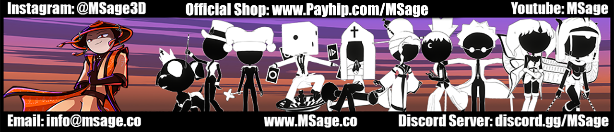

<p align="center">
  
</p>

<h1 align="center">Shader Master <sub>by MSage</sub></h1>

<p align="center">
  A creator-focused Unity shader for stylized characters, props, reactive materials, transformations, shader-native text, and high-impact VRChat visuals.
</p>

<p align="center">
  <a href="https://msage3d.github.io/shader-master-by-msage/"><strong>Open the Interactive Wiki</strong></a>
  ·
  <a href="https://github.com/MSage3D/shader-master-by-msage/releases/latest"><strong>Latest Release</strong></a>
  ·
  <a href="https://www.msage.co/"><strong>MSage Website</strong></a>
  ·
  <a href="https://msage.co/discord"><strong>Join the Discord &amp; Become a Supporter</strong></a>
</p>

> Current release: **v0.4.31** · Unity shader path: `MSage/Shader Master`

## What Shader Master is

Shader Master brings everyday surface controls, stylized lighting, modular special effects, animation-ready properties, creator workflow tools, and VRChat-aware rendering into one organized material inspector. Major systems are opt-in, so creators can keep materials simple or build layered showcase effects without changing shaders.

The custom **MSage Unity Theme** keeps large material setups navigable through searchable categories, sections, and subsections. Every major scope has purpose-built controls, tooltips, copy/paste support, reset behavior, and preset workflows.

## Feature highlights

| Area | Included systems |
| --- | --- |
| Main materials | Base color and textures, normal and alpha maps, emissions, MatCaps, UV selection, panning, hue and color adjustments |
| Stylized shading | Five shadow models, sixteen rim-light modes, metallic and roughness workflows, jewelry, skin, cloth, wetness, weathering, and surface detail |
| Outlines | Multiple outline styles, masks, audio-reactive behavior, camera-aware controls, and configurable width/color behavior |
| Special Effects | Galaxy, Glitter, Force Field, PlayStation-inspired rendering, Hologram, Eye FX, Dream FX, Temporal Split FX, and other modular systems |
| Text Tools | Shader-native Name Tags, Large Tags, typing text variations, alignment, fitting, sub-text, icons, font atlases, and animation controls |
| Dissolves & Transformations | Seventeen built-in transformation presets, dissolve progress, transition edges, motion, independent decal dissolves, and UV tile discard |
| Render & VRChat | Transparency modes, mirror and VRCCam variants, quality tiers, adaptive detail, fog/culling/depth controls, and VRChat-focused optimization options |
| AudioLink | Audio-reactive shader effects plus editor-only Base, Low Mid, High Mid, and Treble preview sliders that reset before builds/uploads |

## Creator Tools

Shader Master includes a separate **Creator Tools** window under:

`MSage → Shader Master by MSage → 3. Creator Tools`

### Material Tools

- Target multiple materials with indexed slots or drag-and-drop.
- Auto-detect common texture roles from nearby project assets.
- Convert materials non-destructively to Shader Master.
- Generate VRChat Quest-compatible material copies.
- Save Shader Master materials as reusable presets.

### VRC Toggle Tools

- Select only loaded avatars with a `VRCAvatarDescriptor`.
- Target a renderer, material slot, and marked numeric/toggle shader property.
- Generate On, Off, On & Off, Slider, or mesh-active animation clips.
- Merge compatible clips deterministically while blocking conflicting bindings.
- Create Radial Puppet, On/Off, and Dissolve FX layers.
- Generate/update expression parameters with saved and network-synced values.
- Choose **Default On** or **Default Off** for the generated parameter and FX state.
- Generated animator states use **Write Defaults On**.
- Optionally create the avatar's root Expressions Menu and place the control on the selected root menu or submenu.

VRChat-specific tools compile only when the VRChat Avatars SDK is installed. Material tools and the shader remain available without it.

## Installation

1. Download the latest `.unitypackage` from [Releases](https://github.com/MSage3D/shader-master-by-msage/releases/latest).
2. Open the target Unity project.
3. Import the package and keep all Shader Master files selected.
4. Create or select a Material and choose `MSage/Shader Master` from the Shader dropdown.
5. Read the [interactive wiki](https://msage3d.github.io/shader-master-by-msage/) for the full workflow and feature reference.

For VRChat avatar projects, use the Unity version and VRChat Creator Companion setup currently supported by VRChat. Custom shaders are PC-only; Quest/Android avatars require a compatible mobile shader material.

## Updating

The bottom of the Shader Master material inspector includes **Check for Updates** and **Support MSage on Discord**. The updater compares the installed `Version.txt` against this repository's `latest.json`, then links to the matching release when a newer version is available. The support button opens the MSage Discord, where creators can join the community and become supporters of continued Shader Master development.

Every release publishes a SHA-256 hash. You can verify a downloaded package in PowerShell:

```powershell
Get-FileHash "Shader Master by MSage-v0.4.31.unitypackage" -Algorithm SHA256
```

Compare the result with both the GitHub release notes and `latest.json` before importing.

## Documentation

The full documentation is published as a searchable GitHub Pages site:

**https://msage3d.github.io/shader-master-by-msage/**

It includes quick-start guidance, inspector workflow, a feature index, optimization notes, VRChat considerations, and troubleshooting. The source lives in [`docs/`](docs/) so documentation changes are versioned with each release.

## Compatibility and safety

- Existing shader property identifiers are preserved so material values and presets remain compatible across product renames and upgrades.
- Material conversion creates new assets and preserves the originals.
- VRC toggle generation updates deterministic Shader Master layers and parameters without replacing unrelated FX content.
- AudioLink test values are editor-only and reset before Play Mode, builds, and VRChat avatar preprocessing.
- Use source control or a project backup before changing production avatar controllers.

## Support and feedback

Join the [MSage Discord](https://msage.co/discord) for the community and supporter options that help fund continued Shader Master development.

Before reporting a problem, include:

- Shader Master version
- Unity version
- VRChat SDK version, when applicable
- Exact console error and reproduction steps
- Whether the issue occurs in the Scene view, Game view, mirror, VRCCam, or uploaded avatar

See [SUPPORT.md](SUPPORT.md) for the report checklist and scope.

## License

Copyright © 2026 MSage. All rights reserved. Shader Master by MSage is proprietary software. Downloading or purchasing the product does not grant permission to redistribute, resell, mirror, sublicense, or publish its source/assets. See [LICENSE.md](LICENSE.md).
